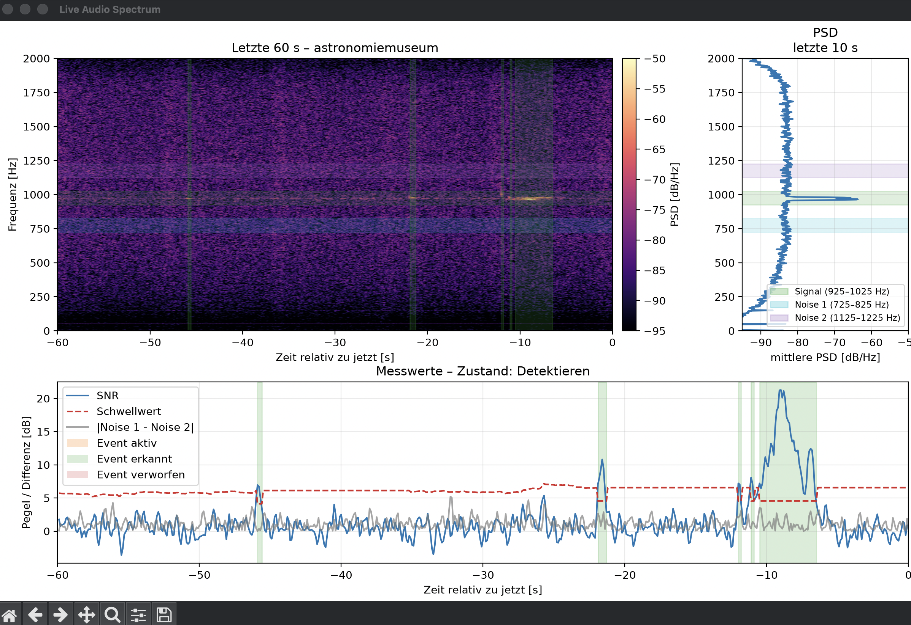
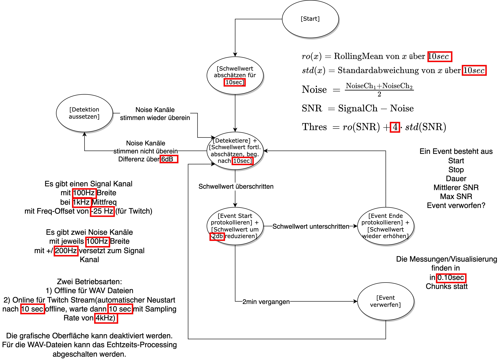

# Meteor Scatter V2

Detect meteors using 6-meter radio waves from
the [live stream of the Astronomiemuseum der Sternwarte Sonneberg](https://www.twitch.tv/astronomiemuseum) or from
wav-files.

The DSP approach described in the [publication](https://www.imo.net/wgn-issue-54-2-april-2026/) *Meteor Detection based
on Forward Scattering with SDR and the BRAMS Beacon* is implemented here. There are separate analysis tools.

Old [version, repository and deprecated/long description](https://github.com/maxbundscherer/meteor-scatter).

## Examples (live detections)

## Visualizations (csv files)

tbd

## Approach

## Instructions

### Install

#### macOS or newer linux

- `python3.14 -m venv .venv`
- `source .venv/bin/activate`
- `pip install -r requirements.txt`

#### Old Ubuntu

- `python -m venv .venv`
- `source .venv/bin/activate`
- `pip install -r requirements_ubuntu.txt`

### Run

#### Detection

- `source .venv/bin/activate`
- `./run_wav.sh` (offline demo) or `./run_twitch.sh` (live stream from Astronomiemuseum der Sternwarte Sonneberg)

#### Analyze

- `source .venv/bin/activate`
- `python meteor_analyse.py`

#### Old Analyze

- `old/MS.ipynb`
